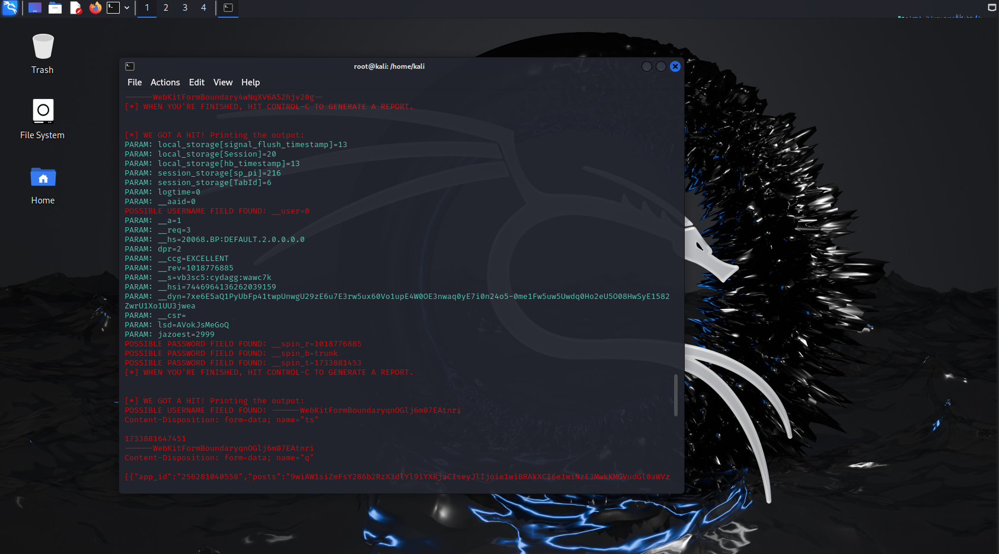

# Phishing para captura de senhas do Facebook

### Ferramentas

- Kali Linux
- setoolkit

### Configurando o Phishing no Kali Linux
    *Primeiro eu fiz o downlonads do Kali para conseguir acessar no virtual box
    *Em seguida acessei pelo virtual box o Kali e acessei o terminal

 ### No terminal
- Fiz o acesso como root: ``` sudo su ```
- Iniciei o setoolkit: ``` setoolkit ```
- Selecioneu o tipo de ataque: ``` Social-Engineering Attacks ```
- Em seguida selecioneu o vetor de ataque: ``` Web Site Attack Vectors ```
- Método de ataque: ```Credential Harvester Attack Method ```
- Método de ataque: ``` Site Cloner ```
- Obtendo o endereço da máquina: ``` ifconfig ```
- URL para clone: http://www.facebook.com

### Resutados





